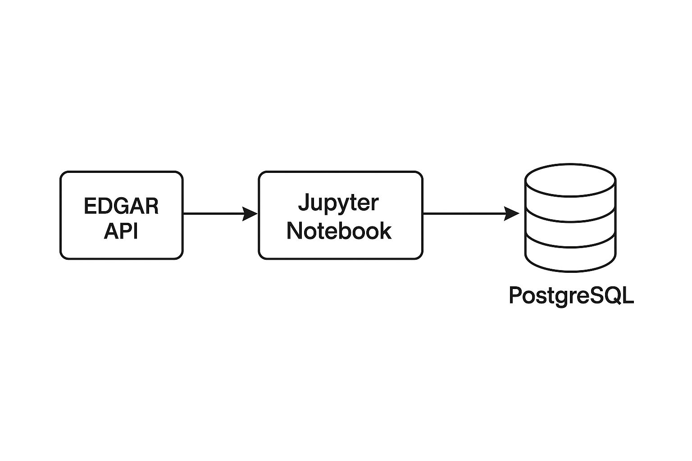

# Form-13F-Institutional-Holdings-Analysis

In this repo, I extract data from 13F filings using the EDGAR API and save them into a PostgreSQL database managed with pgAdmin.

📏Who are institutional investors?

Institutional investors are large entities that invest significant amounts of money on behalf of their clients. 
Examples include hedge funds and pension funds. ◼

📏What is form 13F filing? 

 Since 1978, institutional investment managers—including hedge funds—that exercise investment discretion over accounts with at least $100 million must file Form 13F with the SEC each quarter, within 45 days of quarter-end, as required by Section 13(f) of the Exchange Act. ◼

📏Where to get institutional investor data?

EDGAR provides an API to access these filings, which include data on filing companies and their holdings. The filing company is the institutional investor, and the holdings are the companies whose stocks they own.

▷What is the structure of the data? 
      I save the API data in two main tables: one for filings and one for holdings. These tables can be joined using filing_id:
  
      ```
      | Filings table            |
      |--------------------------|
      | filing_id (PRIMARY KEY)  |
      | cik                      |
      | filer_name               |
      | period_of_report (date)  |

      ```
       ```
      | Holdings table    |
      |------------------ |
      | filing_id         |
      | name_of_issuer    |
      | cusip             |
      | cik               |
      | title_of_class    |
      | value             |
      | shares            |
      | put_call          |
      ```

 📏How to get the institutional investors data? 

 One straightforward way is to write Python code to retrieve the data (in JSON format) and then save it in a CSV file. The problem is that the volume of this data can be very large and consume a lot of RAM when used later in other scripts. To handle this, I use a PostgreSQL database to retrieve and store the data. This also allows me to leverage SQL tools to work with it more efficiently.  ◼

 📏What do I do in this repo to get this data? 
 
As mentioned earlier, I use Python, PostgreSQL, and the EDGAR API to retrieve and store the data in an efficient and reusable way.
In general, I follow two steps:

▨Set up and implement a PostgreSQL server.

▨Use Python to retrieve the data from the API and save it into the database.
The picture below shows a schematic of the overall process:



 
 ▨Set up and implement a PostgreSQL server: 
 
 I use pgAdmin to connect to the PostgreSQL database. There are other ways to do this, but since I already had pgAdmin installed on my PC, I chose this approach.

 I assume you already have PostgreSQL and pgAdmin installed on your system. Open pgAdmin and, on the left side, create a new server with any name you like (I named mine Edgar). The server should point to      localhost and use the password you set up during installation.

 ▨Establish a connection between the SQL server and Jupyter Notebook (Python):  
 
 ```python
import os
import psycopg2
from psycopg2.extras import execute_batch

conn = psycopg2.connect(
    host="localhost",    # database server address (localhost means same machine)
    port=5432,              # default PostgreSQL port 
    dbname="sec13f",         # name of the database to connect to
    user="postgres",            # username for authentication
    password="****"        # password (this is the data base password)
)

# Disable autocommit so changes must be committed manually
conn.autocommit = False

# Create a cursor object to execute SQL queries
cur = conn.cursor()
```
In this part, just to make sure we are connected to our database, I run the following code to establish a connection, retrieve some data, and then close the connection.

```python
# create a cursor
cur = conn.cursor()

# execute a statement
cur.execute('SELECT version()')

# display the PostgreSQL database server version
db_version = cur.fetchone()

print('PostgreSQL database version:')
print(db_version)

# close the communication with the PostgreSQL
cur.close()
```
The result should look something like this:

```python
PostgreSQL database version:
('PostgreSQL 17.4 on x86_64-windows, compiled by msvc-19.42.34436, 64-bit',)
```
 ▨ Add tables to the database in python: 
Now that we have confirmed we can properly connect to our database through Python, we can start adding tables to it.
The database has three main tables:

1- table of all filing investors.

2- A table of all holdings — these are the firms in which the filing investors hold stock.

3- A table mapping the IDs of filing investors to the IDs of investors. I will not use this table because the mappings generated by EDGAR lack a time frame and are therefore not reliable. Instead, I will use WRDS tables.

Of course, we could create these tables in PgAdmin using SQL queries, but for now, I am focusing on creating them in Python using the table function below.

```python
def create_tables():

     # Create a cursor object to interact with the database
    cur = conn.cursor()

    # Define SQL commands to create the necessary tables
    create_table_commands = (
        # Table to store information about each filing
        """
            CREATE TABLE filings (
                filing_id varchar(255) PRIMARY KEY,    -- unique identifier for each filing
                cik int,                                -- central index key of the filer
                filer_name varchar(255),                -- name of the filer
                period_of_report date                   -- reporting period
            )
        """,
        """
            CREATE TABLE holdings (
                filing_id varchar(255),                  -- reference to the filing ID
                name_of_issuer varchar(255),             -- name of the issuer of the security
                cusip varchar(255),                      -- CUSIP identifier of the security
                cik text,                                -- CIK of the issuer
                title_of_class varchar(255),             -- class of the security
                value bigint,                            -- value of the holding
                shares int,                               -- value of the holding  
                put_call varchar(255)                    -- option type, if applicable
            )
        """, 
        """
            CREATE TABLE holding_infos (
                cusip varchar(255),                         -- CUSIP identifier (link to holdings table)                  
                security_name varchar(255),                 -- name of the security
                ticker varchar(50),                         -- ticker symbol
                exchange_code varchar(10),                  -- exchange code 
                security_type varchar(50)                   -- type of security (e.g., stock, bond) 
            )
        """)

    # create table one by one
    for command in create_table_commands:
        cur.execute(command)
    
    # close cursor
    cur.close()
    
    # make the changes to the database persistent
    conn.commit()
```
If you call the above function using create_tables() and then go to your PgAdmin database interface for the related server, refresh the tables section. You should see three tables — filings, holdings, and holding_infos — with the columns defined above. However, the point is that all the tables are empty — they only contain the column names. To fill them, I connect to the EDGAR API to retrieve the data and then insert it into the corresponding columns defined above.

The first step is to connect to the EDGAR API. To do this, you need an API key, which you can obtain at https://sec-api.io. Then, import the sec_api module in Python.
```python
from sec_api import QueryApi

queryApi = QueryApi(api_key='***')
```
▨ Next, I write a query to connect to the API and retrieve the data in Python. One point worth explaining here is how an API works in practice. The query shown below has specific characteristics, such as the form type and the time horizon from which I want to fetch the data. In my case, I want all filings after 2000-01-01 from form 13F-HR, excluding 13F-HR/A. Typically, each API’s documentation explains these details. For this type of form and query, the relevant documentation can be found here: https://sec-api.io/docs/form-13-f-filings-institutional-holdings-api.

Another important point is that this data has a large volume, so retrieving everything at once is not feasible. Instead, we use a process called pagination. In pagination, we specify a starting point and a page size. The query then fetches data in chunks of that size. For example, if the start is set to 0 and the size is 100, the program retrieves 100 entries beginning at index 0. By increasing the start by the page size, the query moves to the next page (the next 100 entries, in this case) and loads them into Python.

```python
def get_13f_filings(start=0, size=100):
    # Print a message showing which batch is being requested
    print(f"Getting next 13F batch starting at {start}")
    
    query = {
      # Define the query for the EDGAR API
      # - Only retrieve 13F-HR filings (exclude amended 13F-HR/A)
      # - Filter filings from January 1, 2000 onwards
      # - Paginate results with 'from' (start index) and 'size' (batch size)
      # - Sort results by filing date in descending order
      "query": { "query_string": { 
          "query": "formType:\"13F-HR\" AND NOT formType:\"13F-HR/A\" AND periodOfReport:{ 2000-01-01 TO *}" 
        } },
      "from": start,
      "size": size,
      "sort": [{ "filedAt": { "order": "desc" } }]
    }
    # Send the query to the EDGAR API
    response = queryApi.get_filings(query)

    # Return only the list of filings from the API response
    return response['filings']

# Fetch the 10 most recent 13F filings (default size=100, here explicitly set to 10 if needed)
filings_batch = get_13f_filings()

# Load all holdings of the first 13F filing into a pandas DataFrame
# This flattens the nested JSON structure into tabular format
holdings_example = pd.json_normalize(filings_batch[0]['holdings'])
```
▨ Up to this point, we know how to set up the database, connect to it in Python, and write a query to retrieve data from the API into Python. The final step is to write a function that inserts the data into the database using Python.

Here, I write a function to fill the filings and holdings tables. Initially, I created three tables, but I will not use the third one, which is a mapping of the filings’ identifiers. The reason is that the mapping provided by EDGAR does not include a timestamp. For this, I rely on Compustat mappings instead. Since that is beyond the scope of this notebook, I will not address it here.

```python

def save_to_db(filings):
    # Create a cursor object to execute SQL commands
    cur = conn.cursor()

     # Loop over each filing in the list of filings

    for filing in filings:
        # Skip this filing if it has no holdings
        if len(filing["holdings"]) == 0:
            continue

        # SQL insert commands for filings and holdings tables
        # Note: filings use ON CONFLICT (filing_id) DO NOTHING to avoid duplicates

        insert_commands = (
            """
                INSERT INTO filings (
                    filing_id, 
                    cik,
                    filer_name,
                    period_of_report
                ) 
                
                VALUES (%s, %s, %s, %s)
                ON CONFLICT (filing_id) DO NOTHING
            """,
            """
                INSERT INTO holdings (
                    filing_id, 
                    name_of_issuer,
                    cusip,
                    cik,
                    title_of_class,
                    value,
                    shares,
                    put_call
                ) 
                VALUES (%s, %s, %s, %s, %s, %s, %s, %s)
            """,
        )

        # Values for inserting into the filings table

        filing_values = (
            filing["id"],                                   # Unique filing identifier
            filing["cik"],                                  # Central Index Key
            filing["companyName"].upper(),                  # Convert company name to uppercase
            filing["periodOfReport"],                        # Reporting period
        )

          # Insert filing data into the filings table
        cur.execute(insert_commands[0], filing_values)

          # Loop through all holdings associated with this filing
        for holding in filing["holdings"]:

            # Prepare values for inserting into the holdings table
            holding_values = (
                filing["id"],                                                               # Foreign key to link back to filings
                holding["nameOfIssuer"].upper(),                                            # Issuer name, converted to uppercase
                holding["cusip"],                                                           # Security identifier (CUSIP)
                holding.get("cik", ""),                                                     # Some holdings may not have a CIK
                holding["titleOfClass"] if "titleOfClass" in holding else "",               # Security class
                holding["value"],                                                           # Value of the holding
                holding["shrsOrPrnAmt"]["sshPrnamt"],                                       # Number of shares
                holding["putCall"] if "putCall" in holding else ""                          # Option type (if any)
            )

             # Insert holding data into the holdings table
            cur.execute(insert_commands[1], holding_values)

     # Close cursor and commit changes to the database    
    cur.close()
    conn.commit()
    ```
▨ Finally, I write a loop to retrieve all the data through pagination and then write it to the database. Notice how, at the end of each iteration of the loop, I increase the starting point by the value of the page size to move to the next set of data.

```python

def fill_database():
   
    start = 0  # Starting index for pagination
    while True:
        # Starting index for pagination
        filings = get_13f_filings(start=start)

        # If no filings are returned, exit the loop (end of data)
        if not filings:
            break

        # Save the retrieved filings into the database
        save_to_db(filings)
        print('.')

         # Move the starting point forward by 100 (the page size)
        start += 100

    # Sanity check: count total rows in the 'holdings' table
    with conn.cursor() as cur:
        cur.execute("SELECT COUNT(*) FROM public.holdings")
        print("Total holdings in DB:", cur.fetchone()[0])


         # Indicate the process is complete
    print("Done")
```
Now, if I call this last function, which serves as the main function, by typing fill_database(), the output will look something like this:

```python
Getting next 13F batch starting at 0
i
.
Getting next 13F batch starting at 100
i
.
Getting next 13F batch starting at 200
i
.
Getting next 13F batch starting at 300
i
.
Getting next 13F batch starting at 400
i
.
.
.
```
The notebook Edgar_Github.ipynb in the code folder puts all these pieces together.

▨ **Application: How can we calculate the total number of shares held by institutional investors and their corresponding value for each firm (holding)?**

To be clear, we have filers and holdings. Filers are institutional investors, and holdings are the firms whose stock is held by institutional investors.
In the SQL code below, I calculate the total value and number of shares for each holding.


```sql

-- Create a temporary table (CTE) with relevant fields from holdings and filings

with main_table as (
select holdings.cusip as holding_cusip,   -- CUSIP identifier for the holding (firm)
	   holdings.name_of_issuer,			  -- Name of the firm (issuer of stock)
	   holdings.cik as holding_cik,	  -- CIK of the firm (holding)
	   holdings.shares,					  -- Number of shares held
	   holdings. value,					  -- Value of those shares
	   filings.period_of_report,		  -- Reporting period from the filing
	   filings.cik,						  -- CIK of the filer (institutional investor)
	   filings.filing_id				  -- Filing identifier (link between tables)
	   
from holdings 
join filings on holdings.filing_id=filings.filing_id    -- Match each holding with its filing
where holdings.shares is not null)                      -- Exclude rows where shares are missing

-- Aggregate results: total shares and total value per firm (holding) and report period
select holding_cik, 									-- Firm’s CIK
	   holding_cusip,									-- Firm’s CUSIP
		period_of_report,								-- Reporting period
		sum(shares) as all_shares, 						-- Total number of shares held by institutions
		sum(value) as all_value 						 -- Total value of those shares
from  main_table 
where holding_cik is not null							-- Ensure firm has a valid CIK
group by holding_cik, holding_cusip, period_of_report  -- Group at firm-period level
order by period_of_report asc							-- Sort by reporting period (earliest first)
;

```
**References:**

-https://sec-api.io/docs/form-13-f-filings-institutional-holdings-api

-https://medium.com/@jan_5421/analyzing-13f-sec-filings-and-buy-sell-activities-of-institutional-investment-managers-using-python-8bba3dfafd7d

